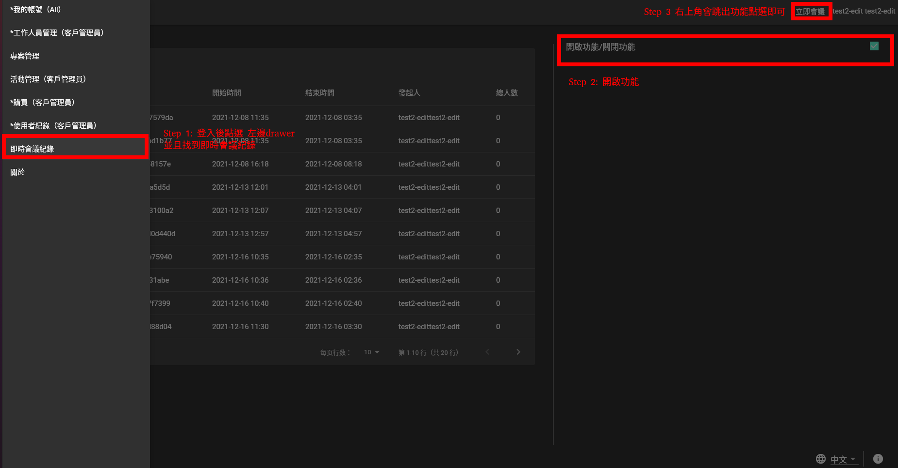
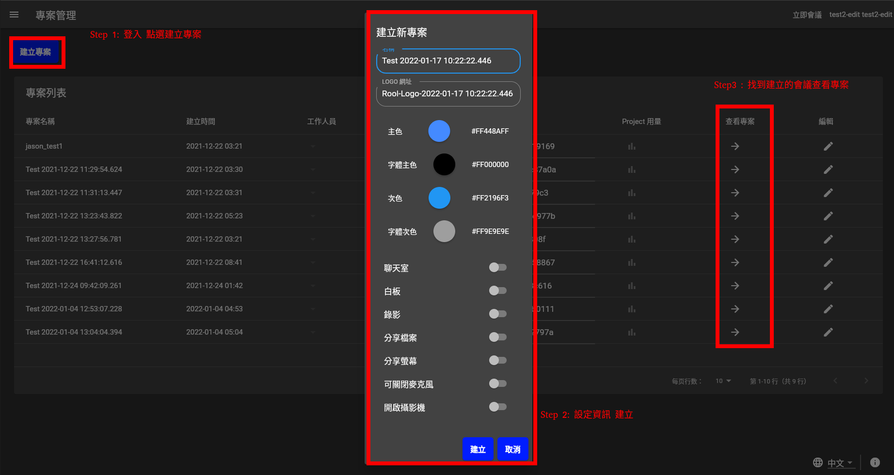
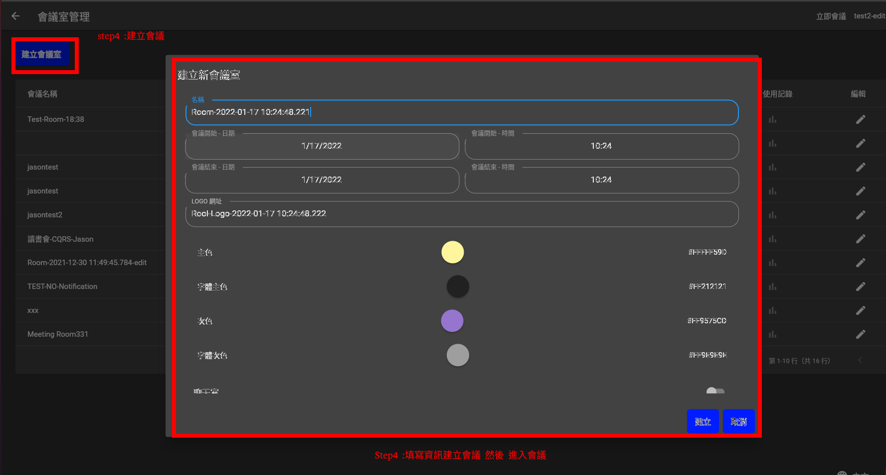
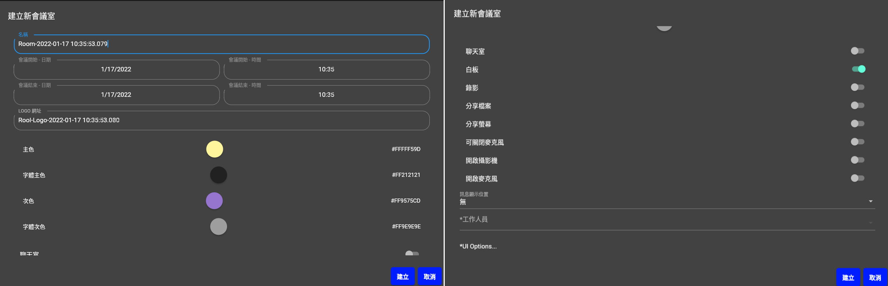
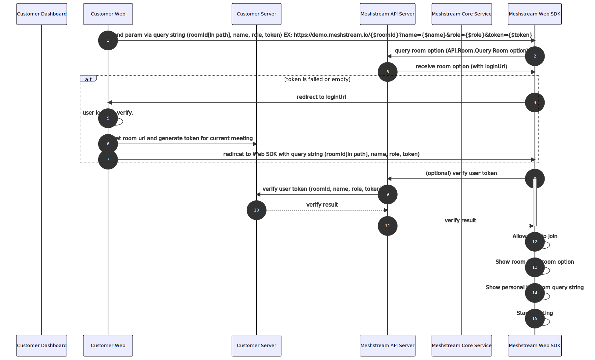

# Meshstream SDK
目前版本為2.1.8
# 目錄
1. [Dashboard申請帳號](#1.Dashboard申請帳號)
2. [建立會議兩種形式](#2.建立會議兩種形式)
3. [會議參數](#3.會議參數)
4. [紀錄](#4.紀錄)
5. [Web SDK](#5.WebSDK)
6. [SDK Sample](#6.SDKSample)
7. [Known issue](#7.KnownIssues)


# 1.Dashboard申請帳號
  * 透過 email
    * 寄信至 : service@meshub.io
    * 必填資訊：
      * 公司名稱 
      * email 
      * 帳號 
      * 姓名
  * change password

# 2.建立會議兩種形式
## 2.1 立即會議（介面操作）

## 2.1 建立預約會議（介面操作）


  
# 3. 會議參數
## 3.1 個人參數
## 3.2 會議室參數

## 3.2.a 整合會員系統
## 3.2.b 介面
## 3.2.c 推播


# 4. 紀錄
(今年二月release)
## 4.1 使用者紀錄
## 4.2 Token
## 4.3 頻寬使用


# 5. Web SDK

# 5.1 直接使用
* 快速上手步驟：
  * 取得帳號
    * 請先申請帳號，審核通過之後會回覆給您一組密碼。
  * 從Dashboard或API建立專案
  * 從Dashboard或API建立會議室
  * 從活動網頁開啟會議室
  * 身份驗證
  * 取得使用紀錄

* 透過呼叫Web SDK API 可直接進行操作
  * Step 1: Login : 請參照 `apidoc` Auth.Login
  * Step 2: Create Project : 請參照 `apidoc` Project.Create
  * Step 3: Create Room : 請參照 `apidoc` Room.Create
  * Step 4: Get URL : 請參照 `apidoc` Room.RoomUrl.Get
  * Step 5: Open URL with Browser : 透過 Browser 以及取得的RoomUrl 開啟Meeting Room 
  
# 5.2 以iframe嵌入

將透過 Call API **Room.RoomUrl** 或 **Room.Query Room Option** 所取得的URL 嵌入iFrame，就能在你原有的Web Page中打開Meeting Room。


# 5.3 會員系統整合

SDK 亦 提供與 原有會員系統串接的機制。

在原有的會員系統上增加 **VerifyToken API** 以及 **Login UI  Redirect Page**，
就能夠進行會員系統與Meshstream 的串接。
* VerifyToken API
  * Request 與Response 請見`apidoc`
* Login UI  Redirect Page
  * 透過Login 原本會員系統，產生Token後，再透過query String Redirect 至 Conference Page
  *詳細流程請參閱下方Sequence diagram





# 5.4 API Documentation

Download link [Apidoc](./apidoc/index.html )
    
    Apidoc :使用時需要先下載(./apidoc/)，再透過瀏覽器開啟./apidoc/index.html


# 6. SDK Sample

* [Ａpi Samlpe code](./api_sample)
  僅列出主流程部分
  ```
  async function Exec (){

  // Step 1: Login ,須先取得測試帳號
  var token = await Login(userAccount,userPassword)

  // Step 2: Create Room , 須先取得Project ID
  var roomOption = initRoomOption();
  let roomName = "Meeting Room For SDK";


  //會議時間區間為 Now, Now add one hour.
  var duration= new Object();
  var now =new Date();
  duration.begin_time=now.toISOString();
  const end_time = new Date(now);
  end_time.setHours(end_time.getHours() + 1);
  duration.end_time=end_time.toISOString();

  //客製化風格示範
  roomOption.ui.logoUrl="https://meshub.io/static/media/logo.293c4ef3.webp";
  roomOption.ui.primaryColor="#ff0000";

  
  var roomId = await CreateRoom(token,projectId,roomName,roomOption,duration)

  // Step 3: GetRoomUrl，實際流程為客戶端啟動，在這邊實作是為了整體流程展現。
  var url = await GetRoomUrl(token,roomId)

  // Step 4: Launch Room with default Browser，實際流程為客戶端啟動，在這邊實作是為了整體流程展現。
  open(url)

  // Step 5 : Launch Ｒoom with Secondary Browser，實際流程為客戶端啟動，在這邊實作是為了整體流程展現。
  //var roomUrl = "https://conference.meshstream.io/"+roomId;
  //open(roomUrl, {app: {name: 'safari'}});
  
  } 

  ```

# 7. Known Issues